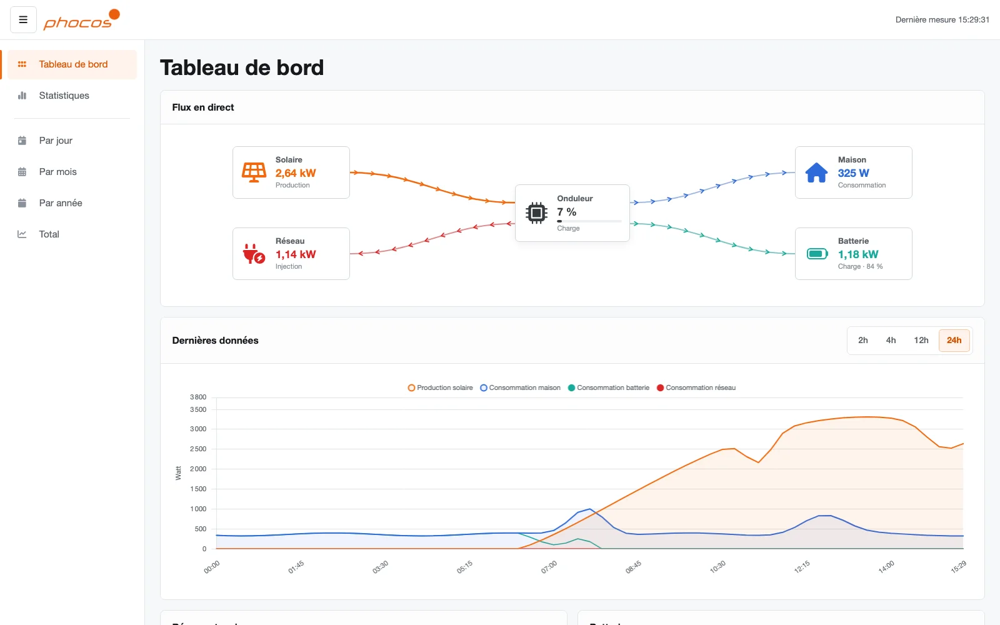
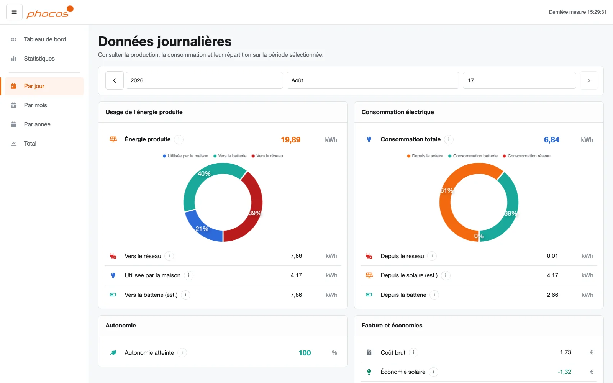
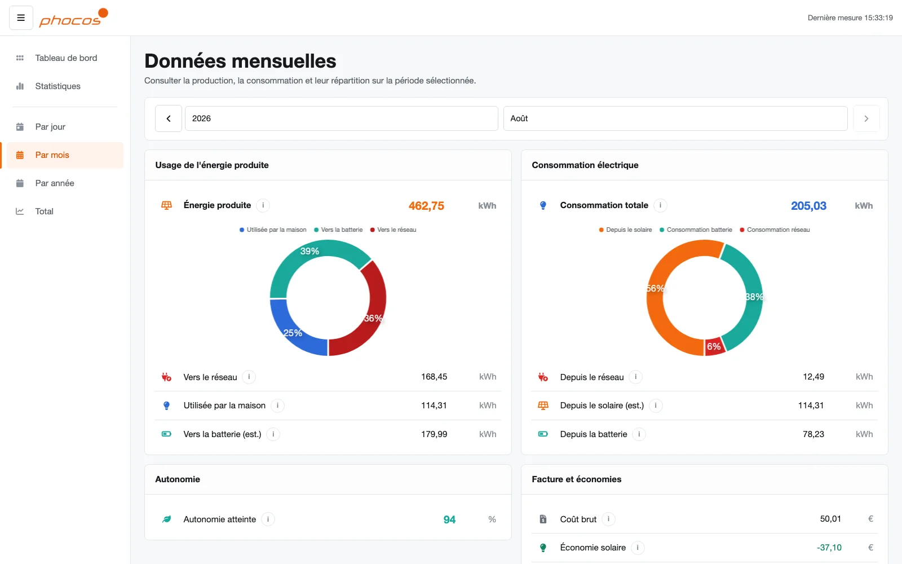

<div align="center">

# PiPhocos

**Tableau de bord local pour les onduleurs Phocos Any-Grid.**

PiPhocos enregistre la production solaire, la consommation, la batterie et les
échanges avec le réseau, puis les présente dans une interface web en français.
Les données restent sur votre installation.

</div>

## Aperçu



*Tableau de bord : flux en direct et courbe des dernières données.*



*Vue journalière : répartition de la production et de la consommation.*



*Vue mensuelle : synthèse du mois dès l'ouverture de l'écran.*

Les captures utilisent un scénario fictif : elles ne contiennent aucune donnée
d'installation réelle ni aucun identifiant matériel.

## Fonctionnalités

- flux énergétiques en direct avec sens des échanges ;
- courbes de puissance et historiques par jour, mois et année ;
- calcul local des kWh produits, consommés, chargés et injectés ;
- suivi de l'autonomie et estimations financières facultatives ;
- export CSV, interface responsive et installation PWA ;
- fonctionnement local, sans service cloud obligatoire.

## Installation rapide

Prérequis : un Raspberry Pi avec Docker et Docker Compose, l'adaptateur
USB/RS232 Phocos et un accès terminal.

Copier l'URL proposée par le bouton **Code** de GitHub, puis :

```bash
git clone <URL-du-dépôt>
cd PiPhocos
mkdir -p data
cp templates/config.yml data/config.yml
```

Deux réglages sont indispensables dans `data/config.yml` :

```yaml
device:
  start_date: 2024-01-01
phocos:
  serial_port: /dev/serial/by-id/votre-adaptateur
```

Le chemin stable de l'adaptateur s'obtient avec :

```bash
ls -l /dev/serial/by-id/
```

Démarrer ensuite PiPhocos :

```bash
export PIPHOCOS_SERIAL_PORT=/dev/serial/by-id/votre-adaptateur
docker compose up --build -d piphocos
```

Le tableau de bord répond par défaut sur `http://localhost:5000`. Pour l'ouvrir
sur un réseau local de confiance, définir `PIPHOCOS_HTTP_BIND` avec l'adresse
LAN du Raspberry Pi avant de relancer Docker Compose.

PiPhocos n'intègre pas d'authentification. Ne l'exposez pas directement sur
Internet : utilisez un LAN de confiance, un VPN ou un proxy authentifié.

Le guide complet couvre également Synology et les diagnostics courants :
[installation](docs/installation.md).

## Configuration facultative

Le fichier fourni fonctionne avec des valeurs par défaut pour le stockage,
l'acquisition et l'interface. Les tarifs d'électricité sont facultatifs et
doivent être adaptés au contrat de chaque installation ; ils ne modifient pas
les mesures physiques en kWh.

- [Fonctionnement, précision et maintenance](docs/fonctionnement.md)
- [Tarification facultative](docs/tarification.md)
- [Modèle de configuration](templates/config.yml)

## Diagnostic rapide

```bash
docker compose ps
docker compose logs --tail=100 piphocos
curl -fsS http://127.0.0.1:5000/api/live
sqlite3 data/db.sqlite "PRAGMA integrity_check;"
```

## Crédits et licence

PiPhocos descend du projet **Sunalyzer** de **Boris Brock (VanKurt)**, adapté
pour un usage Phocos Any-Grid local sur Raspberry Pi.

Publié sous [licence MIT](LICENSE).
