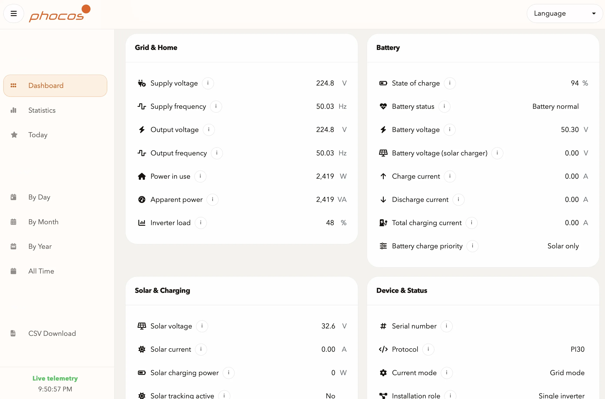
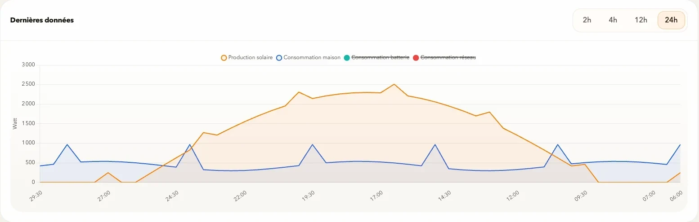
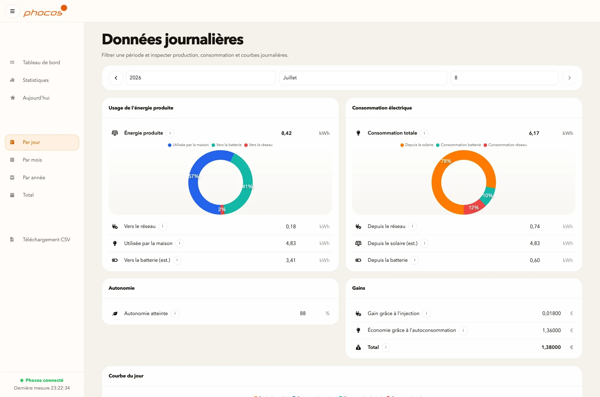

<div align="center">

# PiPhocos

**Tableau de bord et enregistreur local pour Phocos Any-Grid sur Raspberry Pi.**

[](https://www.raspberrypi.org/)
[](https://www.w3.org/WAI/)
[](https://opensource.org/licenses/MIT)

<br>



<br>

PiPhocos collecte localement les donnees d'un onduleur Phocos Any-Grid,
calcule les kWh produits, consommes, charges ou injectes, puis les expose dans
une application web locale. La priorite est la regularite de l'acquisition et
la precision energetique; l'interface peut volontairement se rafraichir moins
souvent que le collecteur.

</div>

---

## Fonctionnalites

- **Acquisition locale** : communication USB/RS232 avec le Phocos, sans cloud.
- **Priorite kWh** : boucle rapide centree sur les puissances utiles aux calculs.
- **Historique energetique** : production, consommation, batterie, import/export.
- **Qualite des intervalles** : distinction entre donnees exactes, derivees,
  cachees, integrees avec gap ou ignorees.
- **Exports CSV** : recuperation des donnees pour analyse externe.
- **PWA locale** : tableau de bord utilisable depuis ordinateur ou mobile.

---

## Captures

Les captures ci-dessous utilisent des donnees synthetiques et ne representent
pas une installation reelle.

<div align="center">
  <table style="border-collapse: collapse; border: none;">
    <tr style="border: none;">
      <td width="50%" align="center" style="border: none;">
        
        <br><i>Courbes de puissance</i>
      </td>
      <td width="50%" align="center" style="border: none;">
        
        <br><i>Donnees journalieres</i>
      </td>
    </tr>
  </table>
</div>

---

## Installation rapide

Pre-requis :

- un **Raspberry Pi** avec Docker et Docker Compose;
- l'adaptateur **USB / RS232 Phocos** connecte au Pi;
- un acces terminal au Raspberry Pi.

### 1. Identifier l'adaptateur

```bash
ls -l /dev/serial/by-id/
```

### 2. Preparer la configuration

```bash
git clone <url-du-depot-git>
cd PiPhocos
mkdir -p data
cp templates/config.yml data/config.yml
```

Modifier `data/config.yml`, notamment :

- `phocos.serial_port`
- `device.start_date`
- `prices.price_per_grid_kwh`
- `prices.revenue_per_fed_in_kwh`
- `privacy.expose_device_identifiers` uniquement si vous acceptez d'afficher
  les identifiants materiels dans l'API et l'interface.
- `database.store_sample_raw_snapshot_json` doit rester `false` sauf diagnostic
  local ponctuel; les colonnes structurees suffisent au calcul kWh.
- `database.raw_history_retention_hours` et
  `database.energy_interval_retention_days` pilotent la compression des points
  bruts et des intervalles kWh detailles.

### 3. Demarrer

```bash
export PIPHOCOS_SERIAL_PORT=/dev/serial/by-id/votre-adaptateur
docker compose up --build -d piphocos
```

Par defaut, le service HTTP est publie sur `localhost` uniquement. Pour une
exposition sur un reseau local de confiance :

```bash
export PIPHOCOS_HTTP_BIND=<ip-lan-du-raspberry-pi>
docker compose up --build -d piphocos
```

### 4. Ouvrir le tableau de bord

- `http://localhost:5000` par defaut;
- `http://<ip-du-raspberry-pi>:5000` si `PIPHOCOS_HTTP_BIND` pointe vers l'IP LAN;
- une route locale ou reverse proxy prive peut aussi exposer un nom local choisi
  par l'administrateur.

PiPhocos n'integre pas d'authentification. Ne pas l'exposer directement sur
Internet; utiliser un LAN de confiance, un VPN ou un proxy prive authentifie.

---

## Precision et performance

PiPhocos se concentre sur les mesures qui changent tout le temps : watts maison,
production solaire, charge/decharge batterie et import/export reseau. Les
commandes Phocos secondaires sont lues plus lentement pour ne pas ralentir la
boucle d'acquisition.

L'interface peut se rafraichir moins vite que le collecteur. C'est volontaire :
la priorite est d'enregistrer les watts a une cadence stable pour reduire
l'ecart kWh avec les compteurs ou factures.

Sur l'installation locale validee, le reglage retenu est `QPGS0` toutes les
1 seconde et `QPIGS` toutes les 30 secondes. La cadence 0,5 seconde reste un
stress test : elle provoque trop de retards sur le lien serie 2400 bauds.

Le stockage est compresse par niveaux : points bruts recents pour le live,
buckets 10 minutes pour les graphes longs, intervalles kWh detailles pour le
recalcul recent, puis rollups journaliers/mensuels/annuels conserves durablement.
Les intervalles anciens ne sont purges qu'apres creation des resumes energie et
qualite, afin que les rapprochements facture restent disponibles.

Documentation technique :

- [Performance d'acquisition](docs/performance-acquisition.md)
- [Precision energetique et reconciliation kWh](docs/energy-accuracy.md)
- [Compression et retention des donnees](docs/storage-compression.md)
- [Plan de test performance](docs/operations/performance-test-plan.md)

---

## Ressources incluses

- [Guide Raspberry Pi](doc/install_raspberrypi.md)
- [Guide Synology NAS](doc/install_synology.md)
- [Modele de configuration](templates/config.yml)
- [Rapport performance acquisition](scripts/acquisition_report.py)
- [Benchmark stockage local](scripts/storage_benchmark.py)
- [Rapport compression SQLite](scripts/compression_report.py)
- [Purge controlee intervalles kWh](scripts/prune_energy_intervals.py)
- [Benchmark serie Phocos](scripts/phocos_serial_benchmark.py)
- [Reconstruction resumes qualite](scripts/rebuild_quality_summaries.py)
- [Scan anonymisation](scripts/privacy_scan.py)
- [Scan langue publique](scripts/public_language_scan.py)
- Documentation protocole : utiliser la documentation officielle Phocos adaptee
  a votre modele d'onduleur.

---

## Credits

Ce projet descend du projet **Sunalyzer** de **Boris Brock (VanKurt)**. La base
initiale a ete adaptee, reduite et optimisee pour un usage Phocos Any-Grid local
sur Raspberry Pi.

---

<div align="center">
  Publie sous <a href="LICENSE">licence MIT</a>
</div>
